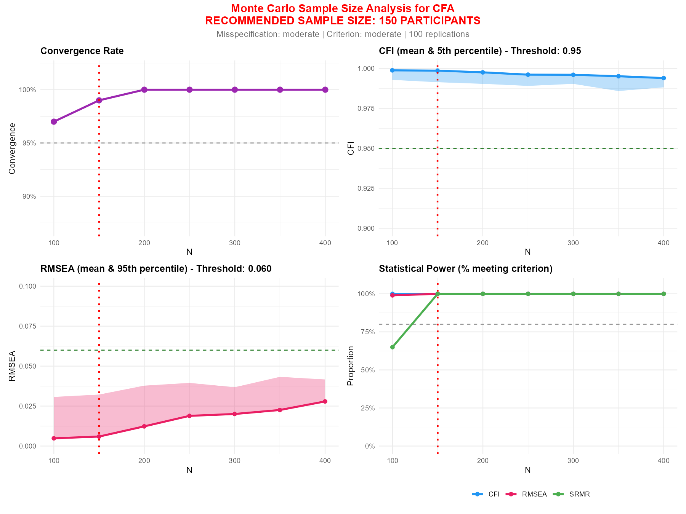
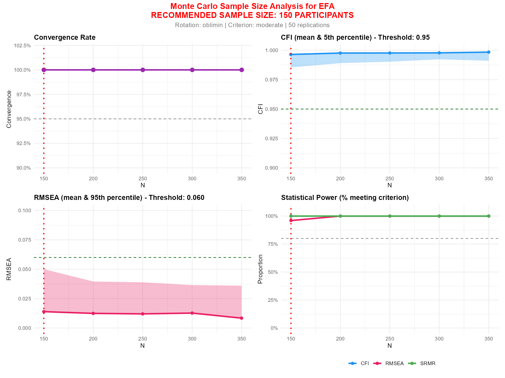

# mcSEM 

<!-- badges: start -->
[](https://github.com/jventural/mcSEM)
[](https://opensource.org/licenses/MIT)
[](https://cran.r-project.org/)
<!-- badges: end -->

## Monte Carlo Sample Size Estimation for Structural Equation Models

**mcSEM** es un paquete de R que utiliza simulación Monte Carlo para estimar el tamaño de muestra óptimo en Análisis Factorial Confirmatorio (CFA) y Análisis Factorial Exploratorio (EFA). El paquete evalúa la potencia estadística basándose en múltiples índices de ajuste (CFI, RMSEA, SRMR) y proporciona recomendaciones robustas para estudios psicométricos.

## Características principales

- ✅ **Soporte para CFA y EFA**: Estimación de tamaño de muestra para ambos tipos de análisis factorial
- ✅ **Análisis A Priori**: Estima el tamaño de muestra sin necesidad de datos previos
- ✅ **Análisis A Posteriori**: Utiliza datos existentes para simulaciones más precisas
- ✅ **Múltiples índices de ajuste**: CFI, RMSEA, SRMR evaluados simultáneamente
- ✅ **Soporte para datos ordinales**: Estimador WLSMV y correlaciones policóricas
- ✅ **Rotaciones EFA**: Soporte para oblimin, varimax, promax y otras rotaciones
- ✅ **Misespecificación realista**: Simula condiciones reales con cross-loadings y correlaciones residuales
- ✅ **Visualización automática**: Gráficos de 4 paneles listos para publicación
- ✅ **Procesamiento paralelo**: Acelera las simulaciones usando múltiples núcleos

## Instalación

```r
# Instalar desde GitHub
devtools::install_github("jventural/mcSEM")
```

## Funciones principales

### CFA (Análisis Factorial Confirmatorio)

| Función | Descripción |
|---------|-------------|
| `mc_cfa_apriori()` | Estimación de tamaño de muestra **sin datos** (modelo teórico) |
| `mc_cfa()` | Estimación de tamaño de muestra **con datos** existentes |

### EFA (Análisis Factorial Exploratorio)

| Función | Descripción |
|---------|-------------|
| `mc_efa_apriori()` | Estimación de tamaño de muestra **sin datos** (modelo teórico) |
| `mc_efa()` | Estimación de tamaño de muestra **con datos** existentes |

---

# CFA: Análisis Factorial Confirmatorio

## Tutorial: Análisis A Priori (CFA)

El análisis **a priori** es útil cuando estás planificando un estudio y necesitas determinar cuántos participantes reclutar. Solo necesitas especificar las características teóricas de tu modelo.

### Ejemplo básico

```r
library(mcSEM)

# Escenario: Escala con 4 factores, 4 ítems por factor, escala Likert de 5 puntos
resultado <- mc_cfa_apriori(
  n_factors = 4,
  items_per_factor = 4,
  loadings = 0.70,
  n_categories = 5,
  misspecification = "moderate",
  reps = 500
)
```

### Salida en consola

```
================================================================
   MONTE CARLO SAMPLE SIZE ANALYSIS FOR CFA (A PRIORI)
================================================================

=== THEORETICAL MODEL ===

  Factors: 4
  Items per factor: 4, 4, 4, 4
  Total items: 16
  Factor loadings: 0.70 (average)
  Factor correlations: 0.30 (average)
  Response categories: 5
  Estimator: WLSMV

=== MISSPECIFICATION ===

  Level: moderate
  Cross-loadings: 0.15
  Residual correlations: 0.15 (15% of pairs)

  NOTE: The FITTED model is simple (no cross-loadings),
        but DATA is generated with realistic misspecification.

=== FIT CRITERIA ===

  Criterion: moderate
  CFI >= 0.95
  RMSEA <= 0.060
  SRMR <= 0.080
  Power target: 80%

=== SIMULATION SETTINGS ===

  Replications: 500 per sample size
  Sample sizes: 100 to 600

================================================================
   RUNNING MONTE CARLO SIMULATION
================================================================

  N = 100 | Conv:  85% | CFI: 0.985 [ 92%] | RMSEA: 0.042 [ 88%] | SRMR: 0.078 [ 52%]
  N = 150 | Conv:  94% | CFI: 0.990 [ 96%] | RMSEA: 0.038 [ 94%] | SRMR: 0.063 [ 85%]
  N = 200 | Conv:  98% | CFI: 0.993 [ 98%] | RMSEA: 0.035 [ 97%] | SRMR: 0.054 [ 96%]
  N = 250 | Conv:  99% | CFI: 0.994 [ 99%] | RMSEA: 0.033 [ 98%] | SRMR: 0.048 [ 99%]
  ...

================================================================
   RECOMMENDATION
================================================================

  Minimum N for convergence (>= 95%): 150
  Minimum N for CFI >= 0.95 (80% power): 100
  Minimum N for RMSEA <= 0.060 (80% power): 100
  Minimum N for SRMR <= 0.080 (80% power): 200

  >>> RECOMMENDED SAMPLE SIZE: 200 PARTICIPANTS <<<
```

### Ver resultados con print()

```r
print(resultado)
```

```
================================================================
           mcSEM: Monte Carlo Sample Size Analysis
================================================================

Type: A Priori (theoretical model)
Model: 4 factors, 16 items
Misspecification: moderate
Estimator: WLSMV
Replications: 500

Fit Criteria:
  CFI >= 0.95
  RMSEA <= 0.060
  SRMR <= 0.080
  Power target: 80%

Minimum N for 80% Power:
  Convergence: 150
  CFI: 100
  RMSEA: 100
  SRMR: 200

================================================================
  RECOMMENDED SAMPLE SIZE: 200 PARTICIPANTS
================================================================

Use result$results for detailed table
Use result$plot for visualization
Use ggsave('filename.png', result$plot) to save plot
```

### Ver tabla detallada con summary()

```r
summary(resultado)
```

```
=== Results Table ===

    n convergence_rate cfi_mean cfi_q05 rmsea_mean rmsea_q95 srmr_mean srmr_q95
1 100            0.850    0.985   0.962      0.042     0.072     0.078    0.095
2 150            0.940    0.990   0.975      0.038     0.062     0.063    0.076
3 200            0.980    0.993   0.982      0.035     0.055     0.054    0.065
4 250            0.990    0.994   0.986      0.033     0.050     0.048    0.057
5 300            0.995    0.995   0.988      0.031     0.047     0.044    0.052

=== Recommendation ===

Recommended N: 200
```

### Guardar visualización

```r
# Guardar gráfico de 4 paneles
ggsave("sample_size_analysis.png", resultado$plot, width = 12, height = 9, dpi = 300)
```



El gráfico incluye:
- **Panel 1**: Tasa de convergencia por tamaño de muestra
- **Panel 2**: CFI (media y percentil 5)
- **Panel 3**: RMSEA (media y percentil 95)
- **Panel 4**: Potencia estadística para cada índice

---

## Tutorial: Análisis A Posteriori (CFA)

El análisis **a posteriori** utiliza datos existentes (por ejemplo, de un estudio piloto) para estimar el tamaño de muestra óptimo. Esto proporciona estimaciones más precisas basadas en la estructura real de los datos.

### Ejemplo con datos

```r
library(mcSEM)

# Definir el modelo CFA
modelo <- '
  F1 =~ item1 + item2 + item3 + item4
  F2 =~ item5 + item6 + item7 + item8
  F3 =~ item9 + item10 + item11 + item12
'

# Ejecutar análisis
resultado <- mc_cfa(
  data = mis_datos,
  model = modelo,
  n_range = seq(100, 400, by = 50),
  reps = 500,
  cor_type = "polychoric",
  estimator = "WLSMV"
)

# Ver recomendación
print(resultado)

# Guardar gráfico
ggsave("mi_analisis.png", resultado$plot, width = 12, height = 9)
```

---

# EFA: Análisis Factorial Exploratorio

## Tutorial: Análisis A Priori (EFA)

El análisis **a priori** para EFA permite estimar el tamaño de muestra necesario cuando planificas un estudio exploratorio. Especificas el número de factores esperados, ítems y características del modelo.

### Ejemplo básico

```r
library(mcSEM)

# Escenario: Escala con 4 factores, 5 ítems por factor, escala Likert de 5 puntos
resultado <- mc_efa_apriori(
  n_factors = 4,
  n_items = 20,
  items_per_factor = 5,
  loadings = 0.70,
  n_categories = 5,
  cross_loadings = 0.10,
  rotation = "oblimin",
  reps = 500
)
```

### Salida en consola

```
================================================================
   MONTE CARLO SAMPLE SIZE ANALYSIS FOR EFA (A PRIORI)
================================================================

=== THEORETICAL MODEL ===

  Factors: 4
  Items per factor: 5, 5, 5, 5
  Total items: 20
  Factor loadings: 0.70 (average)
  Factor correlations: 0.30 (average)
  Cross-loadings: 0.10
  Response categories: 5
  Estimator: WLSMV
  Rotation: oblimin

=== FIT CRITERIA ===

  Criterion: moderate
  CFI >= 0.95
  RMSEA <= 0.060
  SRMR <= 0.080
  Power target: 80%

=== SIMULATION SETTINGS ===

  Replications: 500 per sample size
  Sample sizes: 100 to 600

================================================================
   RUNNING MONTE CARLO SIMULATION
================================================================

  N = 100 | Conv:  92% | CFI: 0.985 [ 88%] | RMSEA: 0.038 [ 92%] | SRMR: 0.045 [ 98%]
  N = 150 | Conv:  97% | CFI: 0.992 [ 96%] | RMSEA: 0.030 [ 98%] | SRMR: 0.036 [100%]
  N = 200 | Conv:  99% | CFI: 0.995 [ 99%] | RMSEA: 0.025 [ 99%] | SRMR: 0.031 [100%]
  ...

================================================================
   RECOMMENDATION
================================================================

  Minimum N for convergence (>= 95%): 150
  Minimum N for CFI >= 0.95 (80% power): 100
  Minimum N for RMSEA <= 0.060 (80% power): 100
  Minimum N for SRMR <= 0.080 (80% power): 100

  >>> RECOMMENDED SAMPLE SIZE: 150 PARTICIPANTS <<<
```

### Ver resultados con print()

```r
print(resultado)
```

```
================================================================
           mcSEM: Monte Carlo Sample Size Analysis
================================================================

Analysis: EFA
Type: A Priori (theoretical model)
Model: 4 factors, 20 items
Cross-loadings: 0.10
Estimator: WLSMV
Rotation: oblimin
Replications: 500

Fit Criteria:
  CFI >= 0.95
  RMSEA <= 0.060
  SRMR <= 0.080
  Power target: 80%

Minimum N for 80% Power:
  Convergence: 150
  CFI: 100
  RMSEA: 100
  SRMR: 100

================================================================
  RECOMMENDED SAMPLE SIZE: 150 PARTICIPANTS
================================================================

Use result$results for detailed table
Use result$plot for visualization
Use ggsave('filename.png', result$plot) to save plot
```

### Guardar visualización

```r
# Guardar gráfico de 4 paneles
ggsave("efa_sample_size.png", resultado$plot, width = 12, height = 9, dpi = 300)
```



---

## Tutorial: Análisis A Posteriori (EFA)

El análisis **a posteriori** para EFA utiliza datos existentes para estimar el tamaño de muestra basándose en la estructura de correlaciones observada.

### Ejemplo con datos

```r
library(mcSEM)

# Ejecutar análisis EFA con 3 factores
resultado <- mc_efa(
  data = mis_datos,
  n_factors = 3,
  items = paste0("item", 1:15),
  n_range = seq(100, 400, by = 50),
  reps = 500,
  cor_type = "polychoric",
  estimator = "WLSMV",
  rotation = "oblimin"
)

# Ver recomendación
print(resultado)

# Guardar gráfico
ggsave("efa_analysis.png", resultado$plot, width = 12, height = 9)
```

---

## Aplicación de las funciones EFA

```r
# Ejemplo 1: EFA con 3 factores y rotación oblimin
mc_efa_apriori(n_factors = 3, n_items = 15, loadings = 0.70, rotation = "oblimin")

# Ejemplo 2: EFA con diferente número de ítems por factor
mc_efa_apriori(n_factors = 4, n_items = 18, items_per_factor = c(5, 5, 4, 4), loadings = 0.65)

# Ejemplo 3: EFA con rotación varimax (ortogonal)
mc_efa_apriori(n_factors = 3, n_items = 12, rotation = "varimax", factor_cors = 0)

# Ejemplo 4: EFA con datos continuos
mc_efa_apriori(n_factors = 2, n_items = 10, n_categories = NULL, estimator = "ML")

# Ejemplo 5: Criterio estricto
mc_efa_apriori(n_factors = 4, n_items = 20, criterion = "strict", reps = 1000)
```

---

## Parámetros importantes

### Niveles de misespecificación

| Nivel | Cross-loadings | Correlaciones residuales | Uso recomendado |
|-------|---------------|-------------------------|-----------------|
| `"none"` | 0.00 | 0.00 | Modelos perfectos (poco realista) |
| `"minor"` | 0.10 | 0.10 | Escalas muy bien construidas |
| `"moderate"` | 0.15 | 0.15 | **Recomendado** - Condiciones típicas |
| `"severe"` | 0.25 | 0.25 | Escalas con problemas conocidos |

### Criterios de ajuste

| Criterio | CFI | RMSEA | SRMR | Uso |
|----------|-----|-------|------|-----|
| `"strict"` | ≥ 0.95 | ≤ 0.05 | ≤ 0.06 | Publicaciones de alto impacto |
| `"moderate"` | ≥ 0.95 | ≤ 0.06 | ≤ 0.08 | **Recomendado** - Estándar común |
| `"flexible"` | ≥ 0.90 | ≤ 0.08 | ≤ 0.10 | Estudios exploratorios |

### Tipos de rotación (EFA)

| Rotación | Tipo | Descripción |
|----------|------|-------------|
| `"oblimin"` | Oblicua | **Recomendado** - Permite correlación entre factores |
| `"promax"` | Oblicua | Similar a oblimin, computacionalmente eficiente |
| `"varimax"` | Ortogonal | Factores no correlacionados |
| `"quartimax"` | Ortogonal | Minimiza complejidad de variables |

---

## Estructura del objeto resultado

```r
resultado <- mc_cfa_apriori(...)

# Elementos disponibles
resultado$n_recommended    # Tamaño de muestra recomendado
resultado$results          # Data frame con resultados detallados
resultado$details          # N mínimo para cada criterio
resultado$model            # Parámetros del modelo teórico
resultado$config           # Configuración utilizada
resultado$plot             # Objeto ggplot2 (4 paneles)
```

---
## Aplicación de la funcion mc_cfa_apriori

```r
# Ejemplo 1: Escala corta (3 factores, 3 ítems cada uno)
mc_cfa_apriori(n_factors = 3, items_per_factor = 3, loadings = 0.75)

# Ejemplo 2: Escala con diferente número de ítems por factor
mc_cfa_apriori(n_factors = 4, items_per_factor = c(5, 4, 4, 3), loadings = 0.65)

# Ejemplo 3: Datos continuos con ML
mc_cfa_apriori(n_factors = 2, items_per_factor = 6, n_categories = NULL, estimator = "ML")

# Ejemplo 4: Criterio estricto para revista de alto impacto
mc_cfa_apriori(n_factors = 4, items_per_factor = 4, criterion = "strict", reps = 1000)
```

---

## Cita

Si utilizas **mcSEM** en tu investigación, por favor cítalo como:

```
Ventura-León, J. (2024). mcSEM: Monte Carlo Sample Size Estimation for
Structural Equation Models. R package version 0.1.0.
https://github.com/jventural/mcSEM
```

---

## Autor

**José Ventura-León**
- GitHub: [@jventural](https://github.com/jventural)

---

## Licencia
MIT © José Ventura-León
